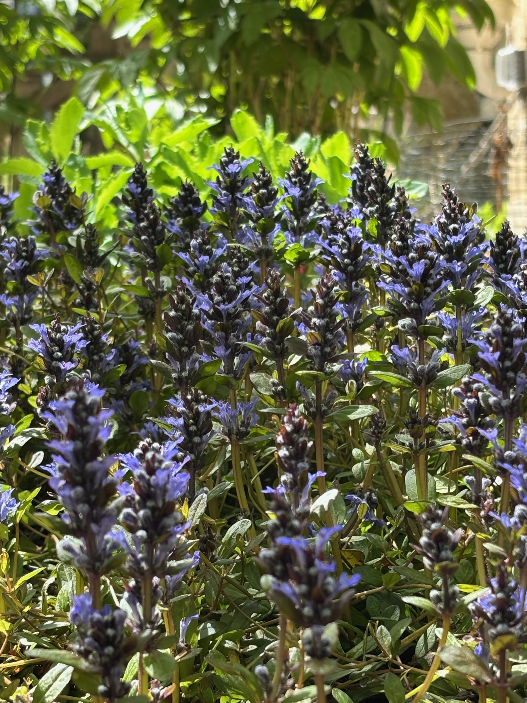
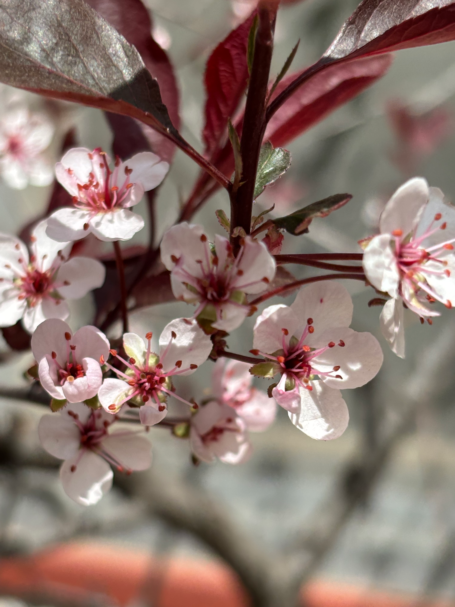

I really didn't intend for Monday to become the day I write these, but here we are. I honestly thought I would write this this morning, but even that didn't go as planned. Kind of a theme for me honestly. Mostly because I don't make plans&mdash;things enter my mind, leave them, return again. I don't recommend it.

Ajuga catching afternoon light..

Anyway, last week I spent a lot of time outdoors. We're getting a lot of nice early-Spring weather here. It's sunny, the skies are blue, there's still a chill in the air in the mornings and evenings, but it's not too bad. I've shed my bulky winter coat for a lighter one or sometimes no coat at all. 

Sand cherry blossoms in the front yard..

The nicer weather has meant I'm not riding the Peloton as much though. I'm keeping my activity streaks alive (which is important to me for reasons I can't explain) by logging all the walks I've been going in in the Peloton app. That's nice, but my walks aren't nearly as strenuous as my rides. I'm also not getting in as many stretching workouts either. 

I spent the week chipping away at my comics backlog. I'm still working my way through the Absolute Green Lantern. I'm 11 or 12 issues in, and maybe four more to go until I'm current. After that I'll start working my way through Ultimate Spider-Man. In other periodical news I finsihed the [Summer 2025 issue of Orion Magazine](https://orionmagazine.org/issue/summer-2025/). Progress!

I also started a non-fiction book "Gateway to Freedom" by Eric Forner. It's about the Underground Railroad, particularly in and around New York City. I don't read a lot of non-fiction, but that's another thing I'm trying to remedy. 

It's possible I'm aiming to be too well-read.

No AT-proto updates this week. No board game updates either. See what I mean about plans? I guess in this case I technically made them. Well, I don't know, saying you're going to do something isn't really the same as making a plan to do it. I guess that's the lesson here. Will I learn it though?

## Things I enjoyed this week
- Charlotte Cornfield's new album "Hurts Like Hell" was on heavy rotation this week. Here's [the video for the title track.](https://youtu.be/RlYNPkFyC1w)
- I somehow ended up playing Dragon's Dogma Online on a fan server. The game never made it out of Japan, but years later there are now at least three different fan servers where you can play it. I've been itching to play an MMO, and this one has been really fun in the early hours. I've been playing on [the Dogma Rising server](https://play.dogmarising.org).
