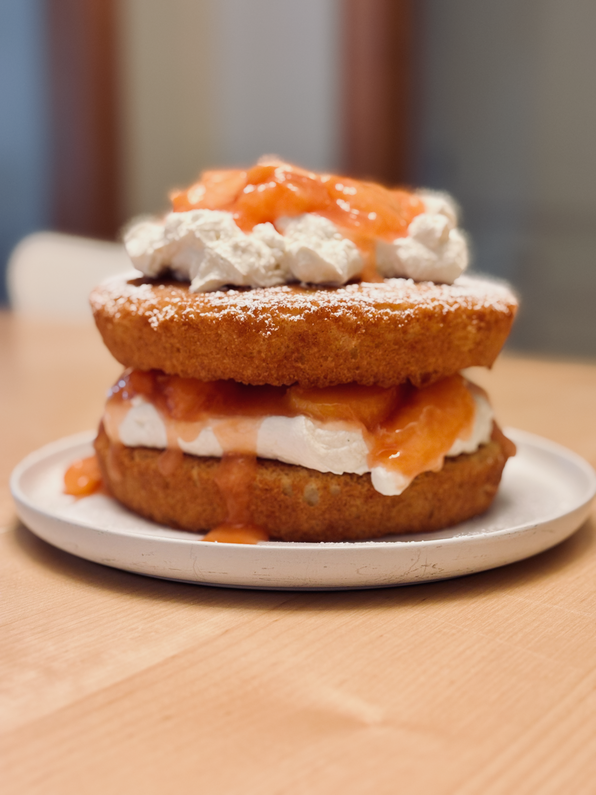

This week's retro is a two-for-one covering this past week and the one before. By the time I should've written last week's entry I just wasn't into it. I kept putting it off until it really didn't make sense to do it anymore. At least not to me. I can't really say why just that I've been in a kind of funk. 

A peaches and cream Victoria sandwich

I did finish reading my comic book backlog. Even better, a new batch of comics arrived this week and I've already read them all. I'm all caught up on every monthly book. I've started tackling my other periodical pile&mdash;back issues of magazines&mdash;and I guess that's the goal now. These projects are really impacting the number of books I've read this year, but I'm still reading so I'm not that troubled by it. Troubled enough to think about it I guess. I'll just have to do a lot of reading in the back half of the year to make up for it.

I did all of my planned Peloton rides these past two weeks and even crossed the 500-ride mark on Friday. I tried getting a shout out in a live ride yet again but didn't get one. I'll try again at the 600-ride mark. 

My other projects&mdash;in person games with real people, playing the board games I own, and learning AT Proto&mdash;are languishing. I think that's partly why I didn't feel like writing one of these last week. They're getting to be repetitive: rode my bike, did nothing else.

I did have an idea about looking into using Tabletop Simulator for one of the games on my challenge list. It's got just a complex enough ruleset that I would benefit from some light automation. That kind of defeats the purpose of tabletop gaming for me since one thing I like about them is they don't involve screens, but I'm willing to try it out if it means me actually playing the games I own. 

We made [this peaches and cream Victoria sandwich](https://cooking.nytimes.com/recipes/781724060-peaches-and-cream-victoria-sandwich) over the Independence Day weekend. It's an odd choice to make a British cake on July 4th, but it was fun to make and delicious to boot. It's an Americanized version of the cake so there's that. 

This coming week is going to be a fun but exhausting one. Some members of one of the teams I manage at work are coming in to town for some in-person collaboration so we've got dinner plans tomorrow and a cook out on Wednesday plus the in-office time. It's a lot for an introvert like me, and I'm sure to be spent by the time they leave on Thursday. In a good way though.

We're also getting new doors installed on our house which has been an expensive, frustrating and educational endeavor so far. Given how most things like that go in a 100-year-old house I'm a little anxious about the install itself.

## Things I enjoyed this week
- For nearly three years on just about every Friday I've been watching [Jeff Gerstmann play and rank every NES game released in North America](https://www.cbc.ca/radio/asithappens/nintendo-entertainment-system-games-ranking-9.7235830). He finally wrapped up that project a few weeks ago and has now started the doing the same thing for N64 projects.
- We watched Project Hail Mary last night and I loved it. It reminded me of the sci-fi comedies of my youth like "Batteries Not Included", "Short Circuit" and "Innerspace". Funny, poignant, and feel good. Just what I needed.